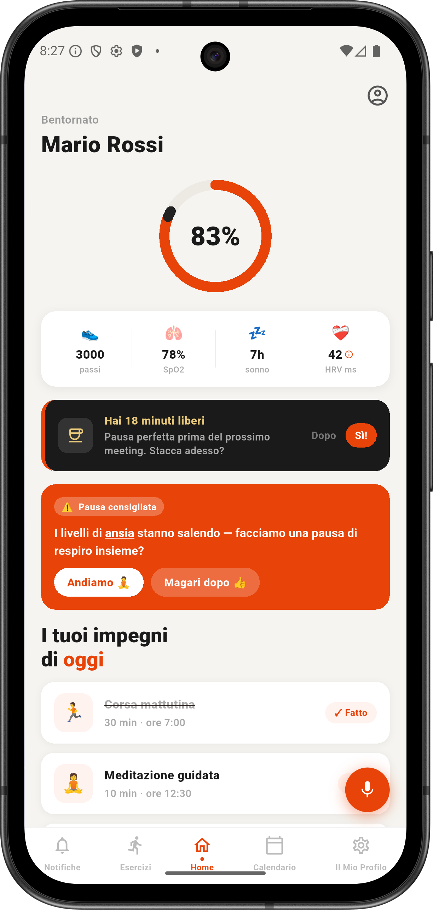
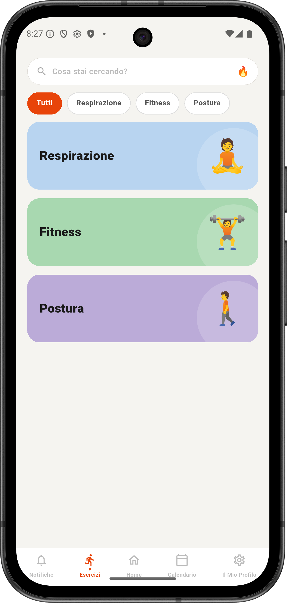
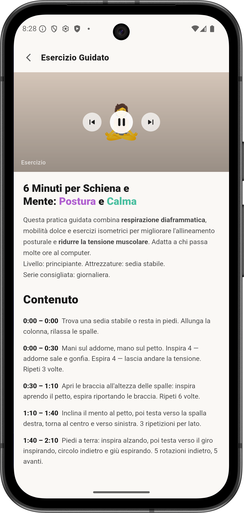
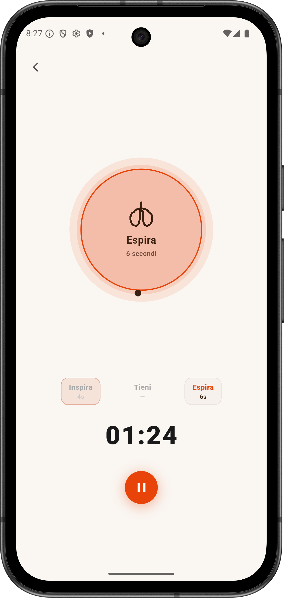
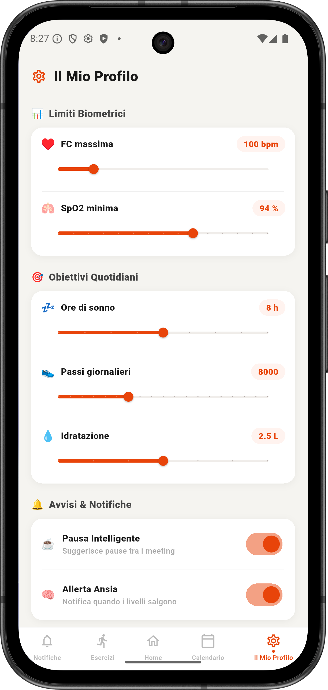
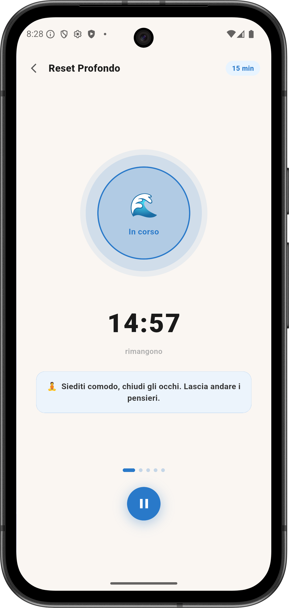

# BioSync

A Flutter application designed to provide a seamless and intuitive user experience.

## Screenshots

<p align="center">
  
  
  
  
  
  
</p>

## 🚀 Getting Started

### Prerequisites

Make sure you have the following installed:

* Flutter SDK
* Dart SDK
* Android Studio or VS Code
* An Android/iOS emulator or a physical device

Verify your Flutter installation:

```bash
flutter doctor
```

## 📥 Installation

Clone the repository:

```bash
git clone https://github.com/Rax-x/biosync.git
```

Navigate to the project directory:

```bash
cd biosync
```

Install the required dependencies:

```bash
flutter pub get
```

## ▶️ Running the Application

Start the app with:

```bash
flutter run
```

## 🛠 Troubleshooting

If you encounter dependency-related errors, run:

```bash
flutter pub get
```

Then try running the application again:

```bash
flutter run
```


## 💻 Technologies Used

* Flutter
* Dart
* Material Design

## 📄 License

This project is available under the MIT License.
